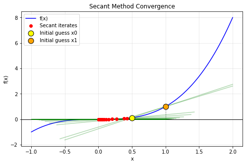
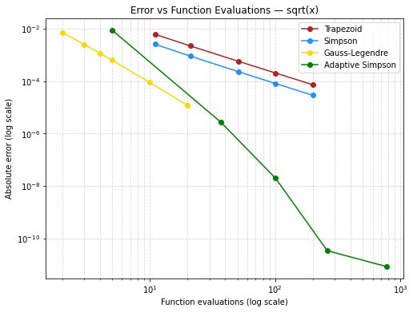

# Numerical Methods for Quantitative Finance

This repository implements core numerical techniques used in quantitative finance, with a focus on finite‑difference PDE solvers and Monte Carlo pricing. The project combines clean, modular Python code with fully annotated Jupyter notebooks that derive the mathematics, implement the algorithms, and validate results against analytical benchmarks.

Despite it being limited as it has been fully implemented in python this is a project to showcase and deconstruct the mathematics behind major projects in the quantitative world.

## Repository Structure

- **notebooks/**
  - **FiniteDifferencePDE.ipynb** — explicit, implicit, and Crank–Nicolson schemes for the heat equation, including stability and convergence analysis.
  - **BlackScholes_PDE.ipynb** — Crank–Nicolson solver for the Black–Scholes PDE with comparison to the analytic Black–Scholes formula.

- **src/numerical_methods/**
  - Reusable solvers for PDEs, Monte Carlo simulation, and linear algebra routines (from experimentation with LU decomposition to Cholesky decomposition).

- **example/**
  - `run_pricing_demo.py` — example script computing option prices using the implemented solvers.

- **results/**
  - Plots and CSV outputs generated by the notebooks.


## Performance & Validation

The notebooks include comprehensive analysis:
- Convergence rate validation (explicit: O(Δt), Crank-Nicolson: O(Δt²))
- Timing benchmarks across grid sizes (50x50 to 500x500)
- Error comparison against Black-Scholes analytical formula
- Scalability analysis for production considerations

  As examples of the plots included in the notebooks:
<table>
  <tr>
    <td align="center">
      <br>
      <em>Secant Method Convergence</em>
    </td>
    <td align="center">
      <br>
      <em>Error vs Function Evaluations — √x Integration</em>
    </td>
  </tr>
</table>

Note that much more can be found inside these notebooks, mainly tables benchmarking the functions against one another.

## Relevance to Quantitative Finance

Finite‑difference PDE methods are widely used in pricing engines for Black–Scholes, local volatility, and early‑exercise products. Crank–Nicolson is a standard scheme in production systems due to its stability and accuracy. Monte Carlo simulation is essential for high‑dimensional derivatives and risk calculations, and matrix decompositions (e.g., Cholesky) are required for generating correlated Brownian motions.

This project demonstrates the numerical foundations behind most models used in practice.

## How to Run

Open any notebook in `notebooks/` to explore the numerical methods, convergence results and error comparisons.


To run the example script:

```bash
python example/run_pricing_demo.py
